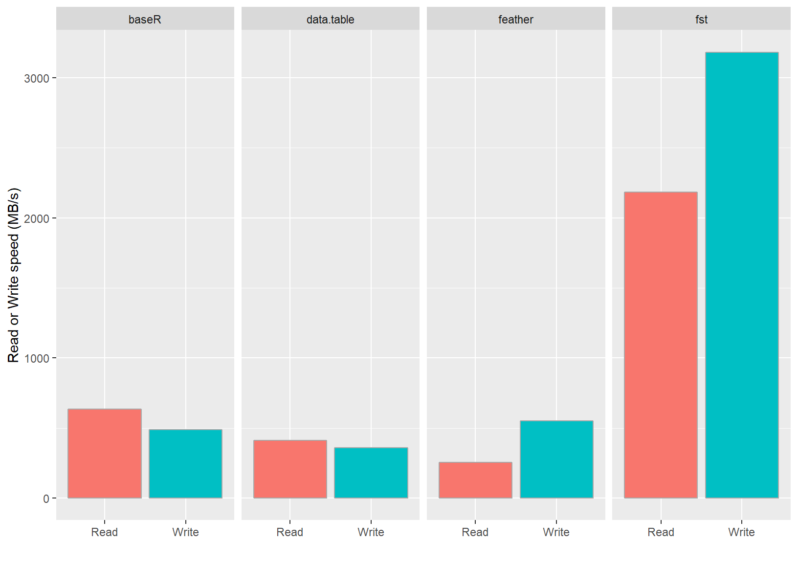
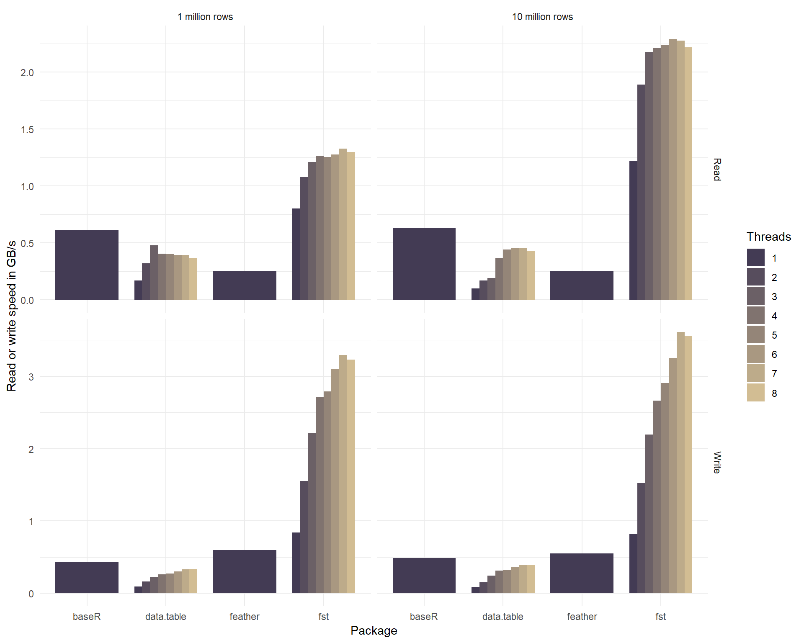

<!-- README.md is generated from README.Rmd. Please edit that file -->


[](https://travis-ci.org/fstpackage/fst)
[](https://ci.appveyor.com/project/fstpackage/fst/branch/develop)
[](https://www.gnu.org/licenses/agpl-3.0)
[](https://cran.r-project.org/package=fst)
[](https://codecov.io/gh/fstpackage/fst)
[](http://cran.rstudio.com/web/packages/fst/index.html)

## Overview

The [*fst* package](https://github.com/fstpackage/fst) for R provides a
fast, easy and flexible way to serialize data frames. With access speeds
of multiple GB/s, *fst* is specifically designed to unlock the potential
of high speed solid state disks that can be found in most modern
computers. Data frames stored in the *fst* format have full random
access, both in column and rows.

The figure below compares the read and write performance of the *fst*
package to various
alternatives.

| Method         | Format  | Time (ms) | Size (MB) | Speed (MB/s) | N       |
| :------------- | :------ | :-------- | :-------- | :----------- | :------ |
| readRDS        | bin     | 1577      | 1000      | 633          | 112     |
| saveRDS        | bin     | 2042      | 1000      | 489          | 112     |
| fread          | csv     | 2925      | 1038      | 410          | 232     |
| fwrite         | csv     | 2790      | 1038      | 358          | 241     |
| read\_feather  | bin     | 3950      | 813       | 253          | 112     |
| write\_feather | bin     | 1820      | 813       | 549          | 112     |
| **read\_fst**  | **bin** | **457**   | **303**   | **2184**     | **282** |
| **write\_fst** | **bin** | **314**   | **303**   | **3180**     | **291** |

These benchmarks were performed on a laptop (i7 4710HQ @2.5 GHz) with a
reasonably fast SSD (M.2 Samsung SM951) using the dataset defined below.
Parameter *Speed* was calculated by dividing the in-memory size of the
data frame by the measured time. These results are also visualized in
the following graph:

<!-- -->

As can be seen from the figure, the measured speeds for the *fst*
package are very high and even top the maximum drive speed of the SSD
used. The package accomplishes this by an effective combination of
multi-threading and compression. The on-disk file sizes of *fst* files
are also much smaller than that of the other formats tested. This is an
added benefit of *fst*’s use of type-specific compressors on each stored
column.

In addition to methods for data frame serialization, *fst* also provides
methods for multi-threaded in-memory compression with the popular LZ4
and ZSTD compressors and an extremely fast multi-threaded hasher.

## Multi-threading

The *fst* package relies heavily on multi-threading to boost the read-
and write speed of data frames. To maximize throughput, *fst* compresses
and decompresses data *in the background* and tries to keep the disk
busy writing and reading data at the same time.

## Installation

The easiest way to install the package is from CRAN:

``` r
install.packages("fst")
```

You can also use the development version from GitHub:

``` r
# install.packages("devtools")
devtools::install_github("fstPackage/fst", ref = "develop")
```

## Basic usage

Using *fst* is simple. Data can be stored and retrieved using methods
*write\_fst* and
*read\_fst*:

``` r
# Generate some random data frame with 10 million rows and various column types
nr_of_rows <- 1e7

df <- data.frame(
    Logical = sample(c(TRUE, FALSE, NA), prob = c(0.85, 0.1, 0.05), nr_of_rows, replace = TRUE),
    Integer = sample(1L:100L, nr_of_rows, replace = TRUE),
    Real = sample(sample(1:10000, 20) / 100, nr_of_rows, replace = TRUE),
    Factor = as.factor(sample(labels(UScitiesD), nr_of_rows, replace = TRUE))
  )

# Store the data frame to disk
  write.fst(df, "dataset.fst")
  
# Retrieve the data frame again
  df <- read.fst("dataset.fst")
```

*Note: the dataset defined in this example code was also used to obtain
the benchmark results shown in the introduction.*

## Random access

The *fst* file format provides full random access to stored datasets.
You can retrieve a selection of columns and rows
with:

``` r
  df_subset <- read.fst("dataset.fst", c("Logical", "Factor"), from = 2000, to = 5000)
```

This reads rows 2000 to 5000 from columns *Logical* and *Factor* without
actually touching any other data in the stored file. That means that a
subset can be read from file **without reading the complete file
first**. This is different from, say, *readRDS* or *read\_feather* where
you have to read the complete file or column before you can make a
subset.

## Compression

For compression the excellent and speedy
[LZ4](https://github.com/lz4/lz4) and
[ZSTD](https://github.com/facebook/zstd) compression algorithms are
used. These compressors (in combination with type-specific bit filters),
enable *fst* to achieve high compression speeds at reasonable
compression factors. The compression factor can be tuned from 0
(minimum) to 100 (maximum):

``` r
write.fst(df, "dataset.fst", 100)  # use maximum compression
```

Compression reduces the size of the *fst* file that holds your data. But
because the (de-)compression is done *on background threads*, it can
increase the total read- and write speed as well. The graph below shows
how the use of multiple threads enhances the read and write speed of our
sample dataset.

<!-- -->

The *csv* format used by the *fread* and *fwrite* methods of package
*data.table* is actually a human-readable text format and not a binary
format. Normally, binary formats would be much faster than the *csv*
format, because *csv* takes more space on disk, is row based,
uncompressed and needs to be parsed into a computer-native format to
have any meaning. So any serializer that’s working on *csv* has an
enormous disadvantage as compared to binary formats. Yet, the results
show that *data.table* is on par with binary formats and when more
threads are used, it can even be faster. Because of this impressive
performance, it was included in the graph for comparison.

## Bindings in other languages

**Julia**:
[**`fstformat.jl`**](https://github.com/xiaodaigh/fstformat.jl) A naive
Julia binding using RCall.jl

> **Note to users**: From CRAN release v0.8.0, the *fst* format is
> stable and backwards compatible. That means that all *fst* files
> generated with package v0.8.0 or later can be read by future versions
> of the package.
